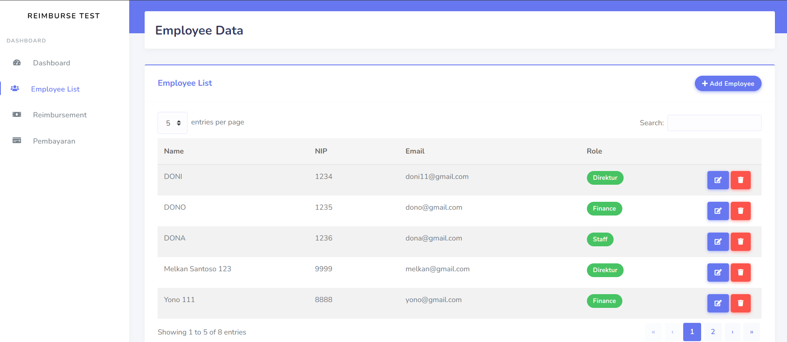
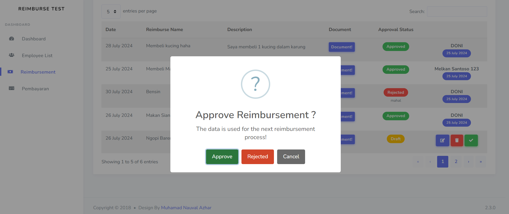
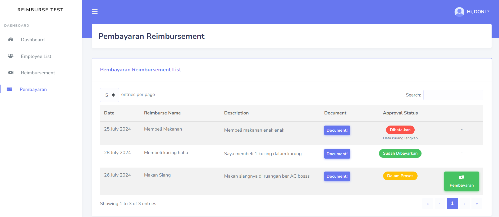

<div align="center">
   <h1>
      Reimbursement Testing
   </h1>
</div>

## Screenshot Project

<p align="center">Dashboard<p>

<br>


<p align="center">Employee Data<p>

<br>


<p align="center">Reimbursement<p>

<br>


<p align="center">Approve Reimbursemenet</p>

<br>


<p align="center">Pembayaran Reimbursemenet</p>

## How to use
1. Clone repository ini
2. setelah itu masuk ke folder, dan ketik di terminal `composer install` agar file bisa digunakan
3. Rubah file `.env.example` menjadi `.env`, kemudian ketik di terminal `php artisan key:generate` untuk menginisialisasi KEY
4. isi data berikut di file `.env` sesuai dengan db yang dibuat
	```env
	DB_CONNECTION=pgsql
	DB_HOST=127.0.0.1
	DB_PORT=3306
	DB_DATABASE=nama_database
	DB_USERNAME=username_phpmyadmin (biasanya root)
	DB_PASSWORD=
	```
5. setelah sukses, tambahkan tabel dengan migrate, caranya adalah dengan ketik di terminal `php artisan migrate`
6. Untuk membuat user khusus ADMIN, maka tambahkan seeder, dengan cara ketik di terminal `php artisan db:seed`
7. Buat folder storage dengan cara `php artisan storage:link`
8. Aplikasi dapat digunakan 😊
